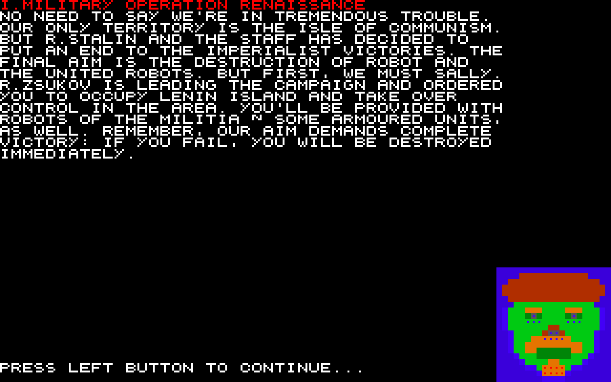
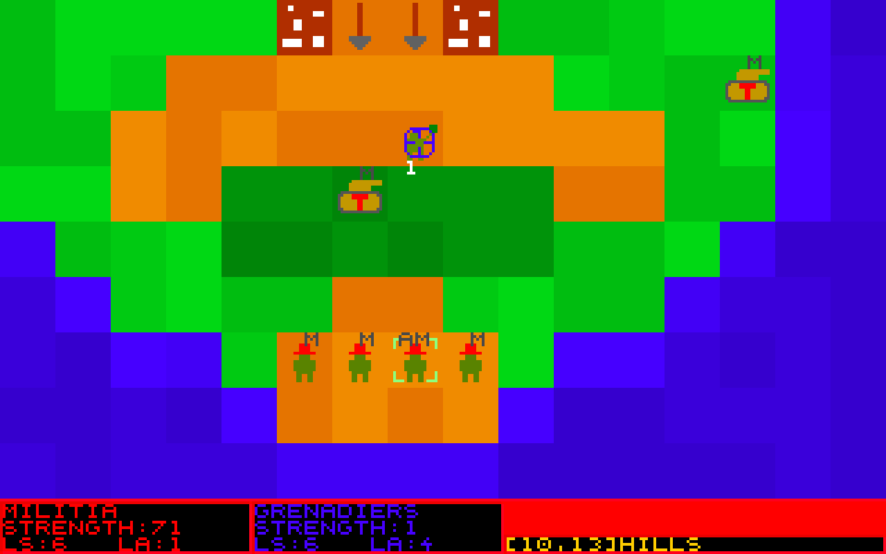
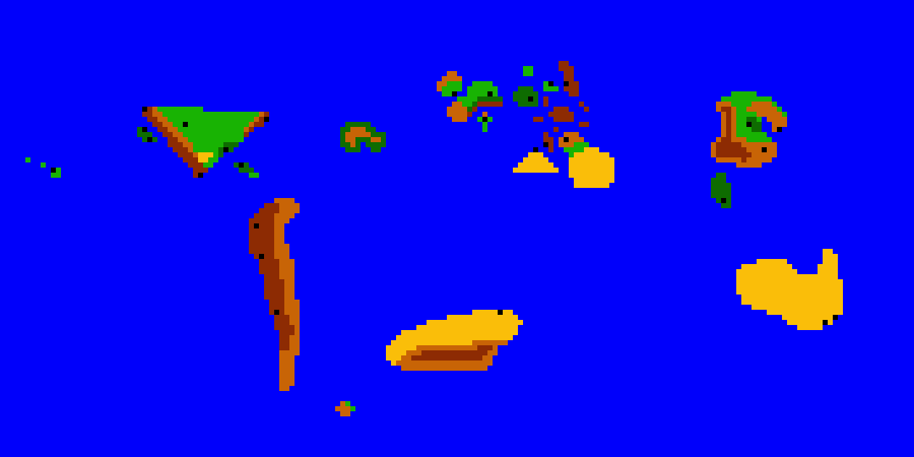
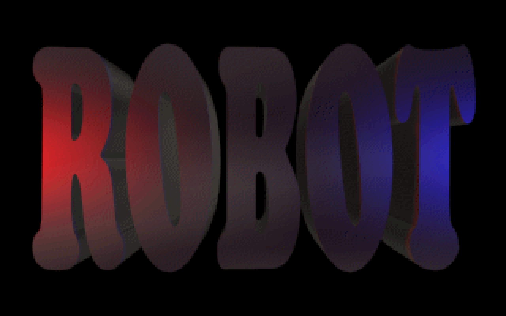

# ROBOT

Turn-based strategy game about communist and capitalist robots fighting for world domination in an alternative future.

Written in 1997 in Pascal (for DOS). Recompiled in 2003 to counter [Runtime error 200](http://en.wikipedia.org/wiki/Runtime_error_200). The game was never finished, but it was the very first game I wrote that actually could be played (and enjoyed).

You can play with the game by running the binary (`ROBOT.EXE`) in [DOSBox](https://www.dosbox.com/).

Screenshots:





Map:



Logo:



## Description of finished campaigns

### I. Military Operation Renaissance
No need to say we're in tremendous trouble. Our only territory is the Isle of Communism. But R.Stalin and the staff has decided to put an end to the imperialist victories. The final aim is the destruction of Robot and the United Robots. But first, we must sally. R.Zsukov is leading the campaign and ordered you to occupy Lenin Island and take over control in the area. You'll be provided with robots of the militia & some armoured units, as well. Remember, our aim demands complete victory: if you fail, you will be destroyed immediately.

### II. Military Operation Prometheus
Victory! But we mustn't stop now. The Brotherhoods' industry badly needs energy. R.Zsukov has named the target: the Kaukazus Isles. You will also take part in the campaign, but with more power and units. Your troops will be landed near a group of nuclear power stations. Destroy all enemy robots and occupy the buildings.

## Communist units (and weapons)

* Militia (rifle)
* Partizans (pistol)
* Veterans (rocket-launcher)
* Riflerobots (Kalashnyikov)
* Artillery (cannon)
* Stalinorgons (Katyusha)
* Tanks (cannon)
* Lasertanks (laser cannon)
* Flametanks (flame cannon)
* Red Death (disintegrator)
* Cannonfodders (grenade)
* Spyrobots (spy-pistol)
* Missile silo (missile)
* Docrobs (needlegun)
* Teslarobots (Teslagun)

## Capitalist units (and weapons)

* Hunters (rifle)
* Snipers (longrange rifle)
* Grenadiers (grenade)
* MGrobots (machine gun)
* Flamers (flamer)
* Terminators (bazooka)
* Hitechs (laser pistol)
* Xhitechs (laser rifle)
* Launchers (V2-rocket)
* Volunteers (shotgun)
* Panzers (cannon)
* Radartrucks (rifle)
* Airfield (airstrike)
* Plasmarobots (plasmagun)
* Hydrotanks (hydrocannon)

## In-game "trying-to-be-funny" tips

* Don't buy any Bill Gates softwares
* Kill Gates
* Microsoft? No thanks
* Defend your deathunits well
* Don't waste your firepower on week enemy units
* Sacrifice your powerless units

## Original credits

```
programmed by
Németh András

graphics by
Németh András

campaign-scenarios by
Németh András

thanks to
Árpád 10/B
Heroes of M&M II.
```
